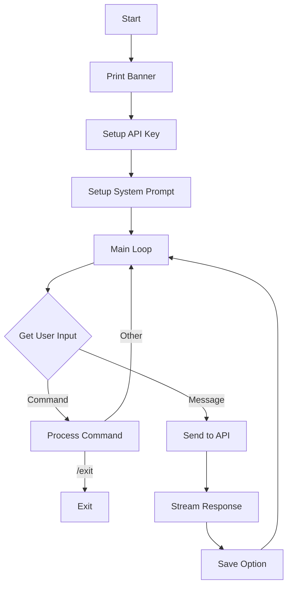

# GLM-4.5 Flash Chat CLI - Documentazione Completa

## Indice
1. [Panoramica](#panoramica)
2. [Architettura](#architettura)
3. [Installazione](#installazione)
4. [Configurazione](#configurazione)
5. [Utilizzo](#utilizzo)
6. [API Reference](#api-reference)
7. [Personalizzazione](#personalizzazione)
8. [Troubleshooting](#troubleshooting)
9. [Performance](#performance)

## Panoramica

### Descrizione
GLM Chat CLI è un'interfaccia conversazionale da terminale per interagire con il modello GLM-4.5-flash tramite l'API Z.AI. Progettata per offrire un'esperienza utente confortevole e professionale, combina la potenza del modello GLM con un'interfaccia intuitiva e ricca di funzionalità.

### Caratteristiche Principali
- **Conversazioni multiturno** con memoria contestuale completa
- **Streaming in tempo reale** delle risposte
- **System prompt personalizzabile** per definire comportamenti specifici
- **Gestione intelligente dell'input** (single-line/multi-line)
- **Salvataggio flessibile** (clipboard, file, export conversazioni)
- **Interfaccia colorata** per miglior leggibilità
- **Gestione errori robusta** con retry automatico

### Requisiti di Sistema
- Python 3.8+
- Sistema operativo: Linux, macOS, Windows (con terminale che supporta ANSI colors)
- Connessione internet stabile
- 50MB di spazio su disco per dipendenze

## Architettura

### Struttura del Progetto
```
llm/
├── glm-chat                  # Script principale (eseguibile)
├── glm-chat-launcher         # Wrapper per ambiente virtuale
├── setup-glm-chat.sh         # Script di installazione automatica
├── requirements-glm.txt      # Dipendenze Python
├── .venv-glm/               # Ambiente virtuale (dopo setup)
└── README-glm-chat.md       # Guida rapida utente
```

### Componenti Principali

#### Classe GLMChatCLI
Il cuore dell'applicazione, gestisce:
- Inizializzazione del client API
- Gestione della conversazione
- Interfaccia utente
- Persistenza dei dati

```python
class GLMChatCLI:
    def __init__(self)
    def print_banner()           # Banner di benvenuto
    def setup_api_key()          # Configurazione API
    def setup_system_prompt()    # System prompt iniziale
    def get_multiline_input()    # Gestione input utente
    def save_response()          # Salvataggio risposte
    def save_conversation()      # Export conversazione
    def process_command()        # Gestione comandi speciali
    def chat_turn()             # Ciclo conversazione
    def run()                   # Loop principale
```

### Flusso di Esecuzione



## Installazione

### Metodo 1: Setup Automatico (Consigliato)
```bash
# Clona o scarica i file
cd /opt/progetti/llm/

# Esegui setup automatico
./setup-glm-chat.sh

# Il setup:
# 1. Crea ambiente virtuale .venv-glm
# 2. Installa tutte le dipendenze
# 3. Configura il launcher
```

### Metodo 2: Installazione Manuale
```bash
# Crea ambiente virtuale
python3 -m venv .venv-glm

# Attiva ambiente
source .venv-glm/bin/activate

# Installa dipendenze
pip install zai-sdk==0.0.3.1
pip install pyperclip==1.9.0
pip install prompt_toolkit==3.0.51
pip install colorama==0.4.6

# Rendi eseguibile
chmod +x glm-chat
```

### Metodo 3: Installazione Globale con pipx
```bash
# Installa pipx se non presente
sudo apt install pipx  # Debian/Ubuntu
brew install pipx      # macOS

# Installa dipendenze
pipx install zai-sdk
pipx inject zai-sdk pyperclip prompt_toolkit colorama
```

## Configurazione

### API Key Configuration

#### Variabili d'Ambiente Supportate
```bash
# Opzione 1: GLM_API_KEY
export GLM_API_KEY="zai-xxxxxxxxxxxxxxxxxxxxx"

# Opzione 2: ZAI_API_KEY  
export ZAI_API_KEY="zai-xxxxxxxxxxxxxxxxxxxxx"

# Permanente (bash)
echo 'export GLM_API_KEY="zai-xxxxx"' >> ~/.bashrc
source ~/.bashrc

# Permanente (zsh)
echo 'export GLM_API_KEY="zai-xxxxx"' >> ~/.zshrc
source ~/.zshrc
```

#### Ottenere una API Key
1. Registrati su https://z.ai
2. Vai a https://z.ai/manage-apikey/apikey-list
3. Crea una nuova API key
4. Copia e salva in modo sicuro

### System Prompt Configuration

Il system prompt definisce il comportamento dell'AI. Esempi:

```python
# Assistente programmazione
"""Sei un esperto programmatore Python. Fornisci codice pulito, 
ben commentato e segui le best practices PEP8."""

# Assistente scrittura
"""Sei un editor professionale. Correggi grammatica, migliora 
lo stile e suggerisci alternative più efficaci."""

# Assistente tecnico
"""Sei un sistemista Linux esperto. Fornisci comandi precisi,
spiega le opzioni e avverti sui rischi potenziali."""
```

## Utilizzo

### Avvio Base
```bash
# Con launcher (gestisce venv automaticamente)
./glm-chat-launcher

# Con alias configurato
glm-chat

# Con Python diretto (dopo attivazione venv)
python3 glm-chat
```

### Modalità di Input

#### 1. Input Single-Line (Default)
```
You> Qual è la capitale della Francia?
[Invio → invia subito]
```

#### 2. Input Multi-Line
```
You> Analizza questo codice:\
(multiline mode - type 'EOF' alone to send)
... def factorial(n):
...     if n <= 1:
...         return 1
...     return n * factorial(n-1)
... EOF
[Il messaggio viene inviato]
```

### Comandi Speciali

| Comando | Descrizione | Esempio |
|---------|-------------|---------|
| `/exit` | Esce dall'applicazione | `You> /exit` |
| `/clear` | Pulisce la cronologia | `You> /clear` |
| `/system` | Cambia system prompt | `You> /system` |
| `/save` | Salva conversazione | `You> /save` |

### Opzioni di Salvataggio

Dopo ogni risposta:
- **c** - Copia nella clipboard di sistema
- **f** - Salva in file (richiede nome)
- **n** - Non salvare

### Export Conversazione

Il comando `/save` genera un file Markdown con:
- Timestamp completo
- Modello utilizzato
- System prompt (se presente)
- Tutti i turni di conversazione formattati

Formato nome file: `glm_conversation_YYYYMMDD_HHMMSS.md`

## API Reference

### Classe GLMChatCLI

#### `__init__(self)`
Inizializza l'istanza del chatbot.

**Attributi inizializzati:**
- `api_key`: Chiave API (None inizialmente)
- `client`: Client Z.AI (None inizialmente)
- `model`: Modello da usare (default: "glm-4.5-flash")
- `conversation_history`: Lista messaggi (vuota)
- `system_prompt`: System prompt (None)
- `session`: PromptSession per input avanzato

#### `setup_api_key(self)`
Configura la chiave API da ambiente o input utente.

**Processo:**
1. Controlla `GLM_API_KEY` in environment
2. Controlla `ZAI_API_KEY` in environment
3. Se non trovata, richiede input interattivo
4. Inizializza il client Z.AI

**Raises:**
- `SystemExit`: Se la chiave non è valida o mancante

#### `chat_turn(self, user_input: str) -> str`
Esegue un singolo turno di conversazione.

**Parametri:**
- `user_input` (str): Messaggio dell'utente

**Returns:**
- `str`: Risposta del modello
- `None`: In caso di errore

**Processo:**
1. Aggiunge user_input alla history
2. Chiama API con streaming
3. Accumula e mostra risposta
4. Aggiunge risposta alla history

### Client Z.AI SDK

#### Inizializzazione
```python
from zai import ZaiClient
client = ZaiClient(api_key="your-key")
```

#### Chat Completion
```python
response = client.chat.completions.create(
    model="glm-4.5-flash",
    messages=[
        {"role": "system", "content": "system_prompt"},
        {"role": "user", "content": "user_message"},
        {"role": "assistant", "content": "ai_response"}
    ],
    stream=True,  # Abilita streaming
    temperature=0.7,  # Creatività (0-1)
    max_tokens=2000,  # Lunghezza massima risposta
    top_p=0.9  # Nucleus sampling
)
```

## Personalizzazione

### Modificare i Colori

Modifica la sezione colori in `glm-chat`:

```python
# Schema colori attuale
Fore.CYAN    # Banner e bordi
Fore.WHITE   # Titolo
Fore.YELLOW  # Headers e prompt
Fore.GREEN   # Comandi e risposte positive
Fore.BLUE    # Prompt utente
Fore.RED     # Errori

# Esempio personalizzazione
def print_banner(self):
    # Cambia Fore.CYAN in Fore.MAGENTA per bordi viola
    lines.append(f"{Fore.MAGENTA}╔{'═' * width}╗")
```

### Aggiungere Nuovi Comandi

1. Aggiungi il comando al banner:
```python
commands = [
    "  /exit     - Exit the chat",
    "  /history  - Show last 10 messages",  # Nuovo
    # ...
]
```

2. Implementa nel metodo `process_command`:
```python
elif command == '/history':
    for msg in self.conversation_history[-10:]:
        print(f"{msg['role']}: {msg['content'][:50]}...")
```

### Cambiare Modello Default

Modifica l'inizializzazione:
```python
def __init__(self):
    self.model = "glm-4.5"  # O "glm-4.5-air"
```

### Aggiungere Parametri API

Modifica `chat_turn` per includere parametri aggiuntivi:
```python
response = self.client.chat.completions.create(
    model=self.model,
    messages=self.conversation_history,
    stream=True,
    temperature=0.8,  # Più creativo
    presence_penalty=0.6,  # Evita ripetizioni
    frequency_penalty=0.5,  # Varia il vocabolario
    max_tokens=4000  # Risposte più lunghe
)
```

## Troubleshooting

### Problemi Comuni e Soluzioni

#### 1. "zai-sdk not installed"
```bash
# Soluzione
pip install zai-sdk
# O usa il setup automatico
./setup-glm-chat.sh
```

#### 2. "API key not found"
```bash
# Verifica variabile ambiente
echo $GLM_API_KEY

# Se vuota, configura
export GLM_API_KEY="your-key"
```

#### 3. "Connection Error" / Timeout
**Possibili cause:**
- Connessione internet instabile
- Firewall/proxy aziendale
- Server API down

**Soluzioni:**
```bash
# Test connettività
ping api.z.ai

# Configura proxy se necessario
export HTTP_PROXY="http://proxy:port"
export HTTPS_PROXY="http://proxy:port"
```

#### 4. "Rate Limit Exceeded"
**Causa:** Troppe richieste in poco tempo

**Soluzione:** 
- Attendi 60 secondi
- Considera upgrade del piano API
- Implementa retry con backoff

#### 5. Clipboard non funziona
```bash
# Linux - installa xclip o xsel
sudo apt install xclip

# macOS - dovrebbe funzionare nativamente
# Windows - richiede pyperclip con win32clipboard
```

#### 6. Colori non visualizzati
```bash
# Verifica supporto ANSI
echo -e "\033[31mTest Colore\033[0m"

# Windows - abilita ANSI
# Aggiungi in glm-chat:
import os
os.system('color')
```

### Debug Mode

Per abilitare il debug, modifica `glm-chat`:

```python
# Aggiungi dopo gli import
import logging
logging.basicConfig(level=logging.DEBUG)

# Nel metodo chat_turn
try:
    response = self.client.chat.completions.create(...)
except Exception as e:
    logging.error(f"API Error: {e}", exc_info=True)
```

## Performance

### Ottimizzazioni

#### 1. Caching delle Risposte
```python
from functools import lru_cache

@lru_cache(maxsize=100)
def cached_completion(prompt_hash):
    return self.client.chat.completions.create(...)
```

#### 2. Batch Processing
Per multiple domande, considera:
```python
questions = ["Q1", "Q2", "Q3"]
responses = []
for q in questions:
    responses.append(self.chat_turn(q))
```

#### 3. Timeout Configuration
```python
import httpx

client = ZaiClient(
    api_key=api_key,
    timeout=httpx.Timeout(30.0, connect=5.0)
)
```

### Metriche

**Tempi di Risposta Tipici:**
- Prima risposta: 200-500ms
- Streaming completo: 1-3s per 500 tokens
- Latenza minima: 150ms

**Limiti:**
- Context window: 128K tokens
- Max output: 4K tokens default
- Rate limit: Dipende dal piano

### Monitoraggio

Aggiungi logging delle performance:

```python
import time

def chat_turn(self, user_input):
    start_time = time.time()
    
    # ... codice esistente ...
    
    elapsed = time.time() - start_time
    print(f"[Performance] Response time: {elapsed:.2f}s")
    
    return full_response
```

## Esempi Avanzati

### 1. Bot Specializzato
```python
# Modifica system prompt per un code reviewer
SYSTEM_PROMPT = """
Sei un senior code reviewer. Analizza il codice per:
1. Bug e vulnerabilità
2. Performance issues  
3. Best practices
4. Leggibilità
Fornisci feedback costruttivo e suggerimenti concreti.
"""
```

### 2. Integrazione con Editor
```bash
# Usa con vim
vim myfile.py
# Seleziona testo e invia a GLM
:'<,'>!./glm-chat-launcher

# Usa con VS Code
# Installa estensione "Run in Terminal"
# Configura comando personalizzato
```

### 3. Scripting Automation
```python
#!/usr/bin/env python3
# auto_review.py

import subprocess
import sys

def review_file(filename):
    prompt = f"Review this code:\n{open(filename).read()}"
    result = subprocess.run(
        ['./glm-chat-launcher'],
        input=prompt + '\n/exit\n',
        capture_output=True,
        text=True
    )
    return result.stdout

if __name__ == "__main__":
    print(review_file(sys.argv[1]))
```

## Changelog

### Version 1.0.0 (Current)
- ✨ Initial release
- 🎨 Colored interface
- 💬 Multi-turn conversations
- 📋 Clipboard support
- 📝 Conversation export
- 🔧 Special commands
- ⚡ Streaming responses

### Roadmap
- [ ] Supporto per immagini
- [ ] History persistente tra sessioni
- [ ] Completamento automatico comandi
- [ ] Temi colore personalizzabili
- [ ] Plugin system
- [ ] Export in formati multipli (PDF, HTML)
- [ ] Integrazione con tool esterni

## Licenza e Contributi

### Licenza
Questo progetto è rilasciato come software libero. Puoi utilizzarlo, modificarlo e distribuirlo liberamente.

### Contribuire
Per contribuire:
1. Fork del repository
2. Crea un branch per le modifiche
3. Invia una pull request
4. Documenta le modifiche

### Crediti
- Sviluppato per l'integrazione con GLM-4.5-flash
- Utilizza Z.AI SDK per le API
- Interfaccia basata su prompt_toolkit e colorama

## Supporto

### Risorse
- [Z.AI Documentation](https://docs.z.ai)
- [GLM-4.5 Model Card](https://z.ai/models/glm-4.5)
- [API Status](https://status.z.ai)

### Contatti
Per problemi specifici:
1. Controlla questa documentazione
2. Consulta i log di debug
3. Verifica lo stato delle API
4. Apri una issue su GitHub

---

*Documentazione aggiornata al: Gennaio 2025*
*Versione: 1.0.0*